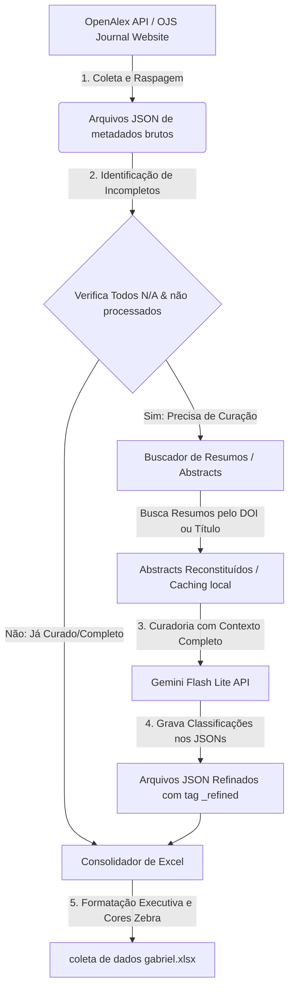

# Extrator de Metadados, Classificação Semântica e Curadoria por IA

[](https://doi.org/10.5281/zenodo.20638523)
[](LICENSE)
[](README_EN.md)

Este diretório contém o pipeline automatizado e inteligente para extração, análise de texto, curadoria semântica e consolidação em planilhas de **todas as publicações científicas** da prestigiada revista **Quantitative Science Studies (QSS)** (Volumes 1 a 6) e do **Encontro Brasileiro de Bibliometria e Cientometria (EBBC)** (anos 2020, 2022 e 2024).

O objetivo deste pipeline é classificar quais ferramentas de software/estatísticas foram aplicadas nos artigos, onde foram aplicadas (coleta, análise ou visualização) e de quais fontes os dados da pesquisa foram extraídos.

---

## 📊 Fluxo de Funcionamento do Pipeline

O diagrama abaixo ilustra o fluxo lógico de execução do projeto, desde a coleta inicial de metadados até a geração da planilha Excel consolidada:



---

## 📂 Estrutura do Projeto

Os arquivos foram organizados de forma modular e limpa:

```text
├── coleta de dados gabriel.xlsx      # Planilha final consolidada com todas as abas estilizadas
├── executar_curadoria.py             # Script atalho de execução na raiz
├── README.md                         # Documentação do projeto
├── datasets/                         # Pasta contendo os conjuntos de dados em JSON
│   ├── cache/                        # Caches locais de resumos do EBBC (evita sobrecarga no OJS)
│   │   ├── ebbc_2020_abstracts_cache.json
│   │   ├── ebbc_2022_abstracts_cache.json
│   │   └── ebbc_2024_abstracts_cache.json
│   ├── ebbc_2020_data.json
│   ├── ebbc_2022_data.json
│   ├── ebbc_2024_data.json
│   ├── qss_volume_1_data.json
│   ├── qss_volume_2_data.json
│   ├── qss_volume_3_data.json
│   ├── qss_volume_4_data.json
│   ├── qss_volume_5_data.json
│   └── qss_volume_6_data.json
└── scripts/                          # Pasta contendo os códigos-fontes do pipeline
    ├── refine_with_abstracts.py      # Script principal do menu interativo e integração IA
    ├── generate_styled_xlsx_all.py   # Gerador da planilha final (todas as abas)
    ├── generate_styled_xlsx.py       # Gerador da planilha (Volumes 5 e 6 do QSS)
    ├── refine_dataset.py             # Curadoria manual específica do Volume 6
    └── ...                           # Outros scripts de extração e suporte
```

---

## 🛠️ Como Funciona e Como Executar (Tutorial)

### Requisitos Próximos
- Python 3.10 ou superior.
- Biblioteca `openpyxl` instalada no ambiente Python:
  ```bash
  pip install openpyxl
  ```

### Executando a Curadoria
Para rodar a curadoria inteligente dos dados e atualizar a planilha Excel, basta executar o atalho criado na raiz do projeto:

```bash
python executar_curadoria.py
```

Isso abrirá um menu de console interativo com estatísticas em tempo real:

```text
============================================================
      SISTEMA DE CURADORIA DE PESQUISAS ACADÊMICAS (IA)
============================================================
Opção  | Dataset              | Total  | Todos N/A (Incompletos)
------------------------------------------------------------
 1     | QSS Vol 1 (2020)     | 91     | 0                     
 2     | QSS Vol 2 (2021)     | 74     | 0                     
 3     | QSS Vol 3 (2022)     | 59     | 0                     
 4     | QSS Vol 4 (2023)     | 52     | 0                     
 5     | EBBC 2020            | 90     | 0                     
...
------------------------------------------------------------
 8    | REFINE TODOS os datasets acima consecutivamente
 9    | RECONSTRUIR Planilha Excel (coleta de dados gabriel.xlsx)
 10   | SAIR
============================================================
Selecione uma opção (1-10):
```

### Explicação das Opções:
- **Opções de 1 a 7**: Rodam a curadoria de IA em um volume/ano específico.
- **Opção 8**: Executa a curadoria em todos os conjuntos de dados que ainda possuem registros não refinados (`Incompletos`).
- **Opção 9**: Apenas lê os dados do diretório `datasets/` e reconstrói a planilha Excel consolidada `coleta de dados gabriel.xlsx` na raiz do projeto.
- **Opção 10**: Fecha o menu.

---

## 🔑 A Importância da Chave do Gemini (API Key)

Para realizar a classificação semântica avançada de texto dos resumos dos artigos, o pipeline utiliza o modelo de inteligência artificial de alta performance **Gemini Flash Lite (`gemini-flash-lite-latest`)** da Google. 

### Por que é necessária?
A IA é responsável por interpretar o resumo textual do artigo (que pode estar em inglês ou português), identificar se um software foi usado ativamente, classificar o local de uso e mapear de onde os dados empíricos foram extraídos. Isso substitui regras simples de busca por palavras-chave (regex), que falham frequentemente em encontrar termos não triviais.

### Como configurar a sua chave de API?
O pipeline possui uma chave pública padrão configurada para execuções iniciais livres. Caso você queira utilizar sua própria chave da Google AI Studio (recomendado para uso em larga escala ou chaves privadas dedicadas):

1. **Configuração Temporária (Terminal)**:
   - No Windows PowerShell:
     ```powershell
     $env:GEMINI_API_KEY="SUA_CHAVE_AQUI"
     python executar_curadoria.py
     ```
   - No CMD (Prompt de Comando):
     ```cmd
     set GEMINI_API_KEY=SUA_CHAVE_AQUI
     python executar_curadoria.py
     ```

2. **Edição do Código**:
   Você também pode editar diretamente o arquivo `scripts/refine_with_abstracts.py` e alterar o valor padrão da variável na linha 16.

---

## 📄 Licença

Este projeto está licenciado sob a Licença MIT - consulte o arquivo [LICENSE](LICENSE) para obter mais detalhes.
