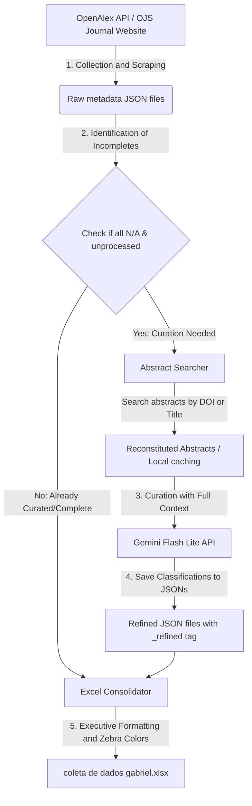

# Metadata Extractor, Semantic Classification, and AI-Driven Curation

[](https://doi.org/10.5281/zenodo.20638523)
[](LICENSE)

[🇧🇷 Português](README.md) | 🇬🇧 **English**

This directory contains the automated and intelligent pipeline for extraction, text analysis, semantic curation, and Excel spreadsheet consolidation of **all scientific publications** from the prestigious journal **Quantitative Science Studies (QSS)** (Volumes 1 to 6) and the **Encontro Brasileiro de Bibliometria e Cientometria (EBBC)** (years 2020, 2022, and 2024).

The goal of this pipeline is to classify which software/statistical tools were applied in the articles, where they were applied (data collection, analysis, or visualization), and from which sources the research data was extracted.

---

## 📊 Pipeline Workflow

The diagram below illustrates the logical flow of the project's execution, from the initial metadata collection to the generation of the consolidated Excel spreadsheet:



---

## 📂 Project Structure

The files are organized in a modular and clean structure:

```text
├── coleta de dados gabriel.xlsx      # Consolidated final spreadsheet with all styled tabs
├── executar_curadoria.py             # Execution shortcut script at the root
├── README.md                         # Project documentation (Portuguese)
├── README_EN.md                      # Project documentation (English)
├── datasets/                         # Folder containing JSON datasets
│   ├── cache/                        # Local caches for EBBC abstracts (prevents overloading OJS)
│   │   ├── ebbc_2020_abstracts_cache.json
│   │   ├── ebbc_2022_abstracts_cache.json
│   │   └── ebbc_2024_abstracts_cache.json
│   ├── ebbc_2020_data.json
│   ├── ebbc_2022_data.json
│   ├── ebbc_2024_data.json
│   ├── qss_volume_1_data.json
│   ├── qss_volume_2_data.json
│   ├── qss_volume_3_data.json
│   ├── qss_volume_4_data.json
│   ├── qss_volume_5_data.json
│   └── qss_volume_6_data.json
└── scripts/                          # Folder containing the pipeline source code
    ├── refine_with_abstracts.py      # Main script with the interactive menu and AI integration
    ├── generate_styled_xlsx_all.py   # Final spreadsheet generator (all tabs)
    ├── generate_styled_xlsx.py       # Spreadsheet generator (QSS Volumes 5 and 6)
    ├── refine_dataset.py             # Specific manual curation for Volume 6
    └── ...                           # Other extraction and helper scripts
```

---

## 🛠️ How it Works and How to Run (Tutorial)

### Requirements
- Python 3.10 or higher.
- `openpyxl` library installed in the Python environment:
  ```bash
  pip install openpyxl
  ```

### Running the Curation
To run the intelligent data curation and update the Excel spreadsheet, simply run the shortcut created at the root of the project:

```bash
python executar_curadoria.py
```

This will open an interactive console menu with real-time statistics:

```text
============================================================
      ACADEMIC RESEARCH CURATION SYSTEM (AI)
============================================================
Option | Dataset              | Total  | All N/A (Incomplete)
------------------------------------------------------------
 1     | QSS Vol 1 (2020)     | 91     | 0                     
 2     | QSS Vol 2 (2021)     | 74     | 0                     
 3     | QSS Vol 3 (2022)     | 59     | 0                     
 4     | QSS Vol 4 (2023)     | 52     | 0                     
 5     | EBBC 2020            | 90     | 0                     
...
------------------------------------------------------------
 8     | REFINE ALL datasets above consecutively
 9     | REBUILD Excel Spreadsheet (coleta de dados gabriel.xlsx)
 10    | EXIT
============================================================
Select an option (1-10):
```

### Explanation of Options:
- **Options 1 to 7**: Run the AI curation for a specific volume/year.
- **Option 8**: Runs curation across all datasets that still have unrefined records (`Incomplete`).
- **Option 9**: Reads data from the `datasets/` directory and rebuilds the consolidated Excel spreadsheet `coleta de dados gabriel.xlsx` at the root of the project.
- **Option 10**: Closes the menu.

---

## 🔑 The Importance of the Gemini API Key

To perform advanced semantic text classification of the article abstracts, the pipeline utilizes Google's high-performance AI model **Gemini Flash Lite (`gemini-flash-lite-latest`)**.

### Why is it required?
The AI is responsible for interpreting the text abstract of the article (which may be in English or Portuguese), identifying whether software was actively used, classifying the context of use, and mapping where the empirical data was extracted from. This replaces simple keyword searches (regex), which frequently fail to find non-trivial terms.

### How to configure your API key?
The pipeline comes with a configured public default key for free initial runs. If you want to use your own key from Google AI Studio (recommended for large-scale usage or private dedicated keys):

1. **Temporary Configuration (Terminal)**:
   - On Windows PowerShell:
     ```powershell
     $env:GEMINI_API_KEY="YOUR_KEY_HERE"
     python executar_curadoria.py
     ```
   - On CMD (Command Prompt):
     ```cmd
     set GEMINI_API_KEY=YOUR_KEY_HERE
     python executar_curadoria.py
     ```

2. **Editing the Code**:
   You can also directly edit the `scripts/refine_with_abstracts.py` file and change the default value of the variable on line 16.

---

## 📄 License

This project is licensed under the MIT License - see the [LICENSE](LICENSE) file for details.
